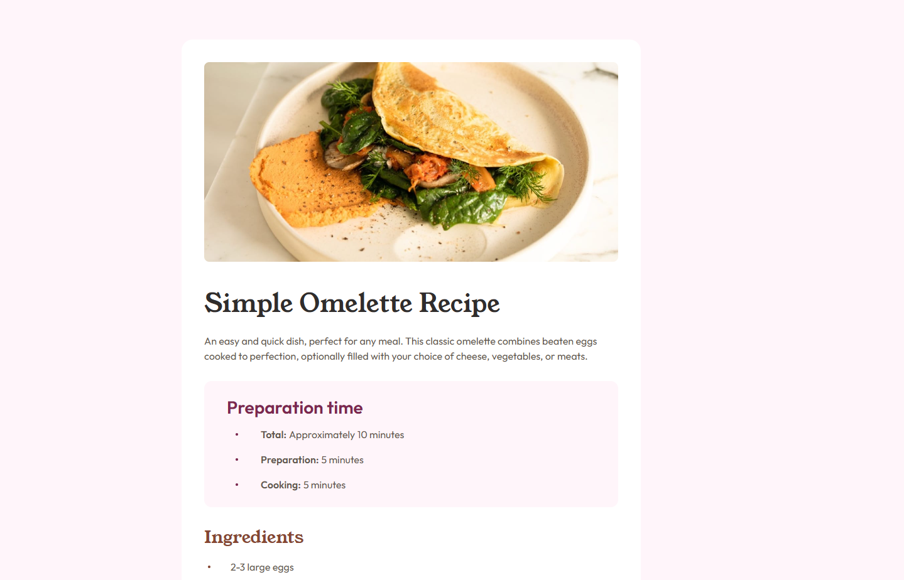

# Frontend Mentor - Recipe page solution

This is a solution to the [Recipe page challenge on Frontend Mentor](https://www.frontendmentor.io/challenges/recipe-page-KiTsR8QQKm). Frontend Mentor challenges help you improve your coding skills by building realistic projects.

## Table of contents

- [Frontend Mentor - Recipe page solution](#frontend-mentor---recipe-page-solution)
  - [Table of contents](#table-of-contents)
  - [Overview](#overview)
    - [Screenshot](#screenshot)
    - [Links](#links)
  - [My process](#my-process)
    - [Built with](#built-with)
    - [What I learned](#what-i-learned)
    - [Continued development](#continued-development)
  - [Author](#author)

## Overview

### Screenshot

### Links

- Solution URL: [Solution](https://github.com/Rahexx/RecipePage)
- Live Site URL: [Live Site](https://rahexx.github.io/RecipePage/)

## My process

### Built with

- HTML5
- SCSS
- Flexbox
- Mobile-first workflow

### What I learned

I used `@includes` for including styles from one class to another.

### Continued development

In the future I want not only use JS or JS frameworks, but I want to write tests for solutions. That would be great if I would use other stuff like GraphQL or Cypress.

## Author

- Frontend Mentor - [@Rahexx](https://www.frontendmentor.io/profile/Rahexx)
